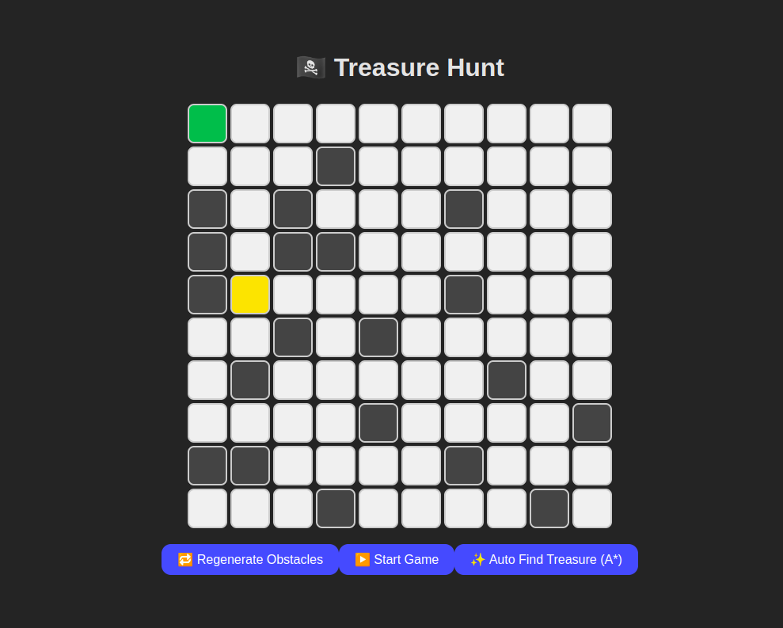

## Treasure Hunt Game

### Overview
The **Treasure Hunt Game** is a grid-based pathfinding game where players must navigate from a starting position to a hidden treasure while avoiding obstacles. The game uses the **A* (A-Star) algorithm** to calculate the shortest path to the treasure efficiently.

### Features
- **Grid-Based Map**: A customizable grid where obstacles and the treasure are randomly placed.
- **A* Algorithm**: Ensures the most efficient pathfinding strategy.
- **No Diagonal Movement**: Players can only move up, down, left, or right.
- **Smart Obstacle Placement**: Ensures there is always a valid path to the treasure.
- **Dynamic Visualization**: Watch the algorithm in action as it finds the best path.

### How to Play
1. Launch the game.
2. The player starts at the given position.
3. The A* algorithm calculates the shortest route to the treasure.
4. Navigate step by step following the computed path.
5. Reach the treasure and win!

### Demo

